## kafka connector技术

### connet简介

​       Kafka是一个使用越来越广的消息系统，尤其是在大数据开发中（实时数据处理和分析）。为何集成其他系统和解耦应用，经常使用Producer来发送消息到Broker，并使用Consumer来消费Broker中的消息。Kafka Connect是到0.9版本才提供的并极大的简化了其他系统与Kafka的集成。KafkaConnect运用用户快速定义并实现各种Connector(File,Jdbc,Hdfs等)，这些功能让大批量数据导入/导出Kafka很方便。

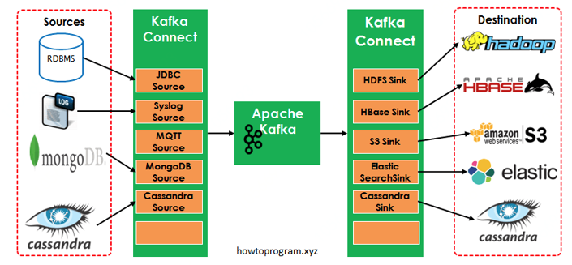                                                        

如图中所示，左侧的Sources负责从其他异构系统中读取数据并导入到Kafka中；右侧的Sinks是把Kafka中的数据写入到其他的系统中。


### connect Concepts

1. Connectors([confluent 文档](https://docs.confluent.io/platform/current/connect/index.html))

​			通过管理task来协调数据流的高级抽象，connector 实例是一个逻辑作业，负责管理kafka与另一个系统之间的数据复制，connector 的开发流程遵循以下工作流程：


​             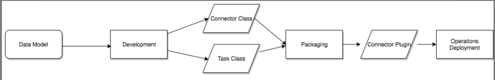                   

connectors与tasks 关系如下：


​              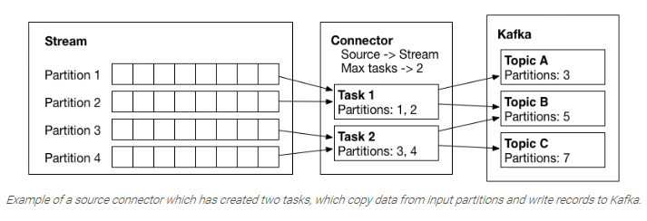
2. Tasks

        如何将数据复制到Kafka或从Kafka复制数据的实现 。Task是Connect数据模型中的主要处理数据的角色。每个connector实例协调一组实际复制数据的task。通过允许connector将单个作业分解为多个task，Kafka Connect提供了内置的对并行性和可伸缩数据复制的支持，只需很少的配置。这些任务没有存储任何状态。任务状态存储在Kafka中的特殊主题config.storage.topic和status.storage.topic中。因此，可以在任何时候启动、停止或重新启动任务，以提供弹性的、可伸缩的数据管道。

    
    ​    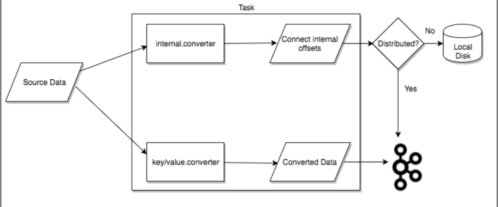 
                                                                                             
        
          当connector首次提交到集群时，workers会重新平衡集群中的所有connector及其tasks，以便每个worker的工作量大致相同。当connector增加或减少它们所需的task数量，或者更改connector的配置时，也会使用相同的重新平衡过程。当一个worker失败时，task在活动的worker之间重新平衡。当一个task失败时，不会触发再平衡，因为task失败被认为是一个例外情况。因此，失败的task不会被框架自动重新启动，应该通过REST API重新启动。

例如：

```shell
curl -X POST -H "Content-Type: application/json" --data '{"name": "local-file-sink", "config": {"connector.class":"FileStreamSinkConnector", "tasks.max":"1", "file":"test.sink.txt", "topics":"connect-test" }}' http://localhost:8083/connectors
```

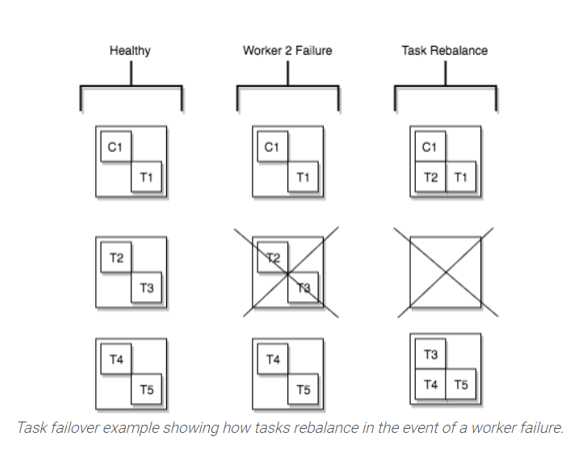

​                                                                                        

3. Workers

      执行Connector和Task的运行进程。worker 工作模式分为Standalone 和 Distributed  两种模式。 Standalone模式是最简单的模式，用单一进程负责执行所有connector和task。分布式模式为Kafka Connect提供了可扩展性和自动容错能力。在分布式模式下，你可以使用相同的组启动许多worker进程。它们自动协调以跨所有可用的worker调度connector和task的执行。如果你添加一个worker、关闭一个worker或某个worker意外失败，那么其余的worker将检测到这一点，并自动协调，在可用的worker集重新分发connector和task。
      
      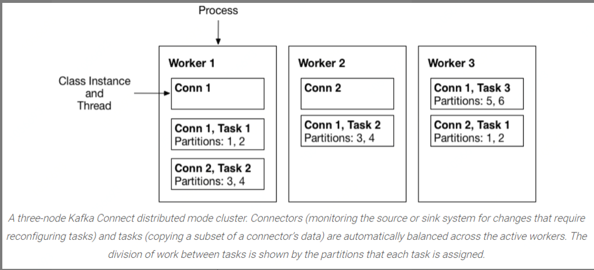

​                  

4. Converters

         		用于在Connect和外部系统发送或接收数据之间转换数据的代码，在向Kafka写入或从Kafka读取数据时，Converter是使Kafka Connect支持特定数据格式所必需的。task使用转换器将数据格式从字节更改为连接内部数据格式，反之亦然。

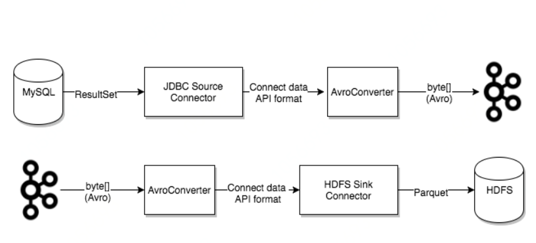

​		常用converters 如下：

​				AvroConverter（建议）：与Schema Registry一起使用

​				JsonConverter：适合结构数据

​				StringConverter：简单的字符串格式

​				ByteArrayConverter：提供不进行转换的“传递”选项

5. Transforms

              更改由连接器生成或发送到连接器的每个消息的简单逻辑,Connector可以配置转换，以便对单个消息进行简单且轻量的修改。这对于小数据的调整和事件路由十分方便，且可以在connector配置中将多个转换链接在一起。然而，应用于多个消息的更复杂的转换最好使用KSQL和Kafka Stream实现。
              
              

 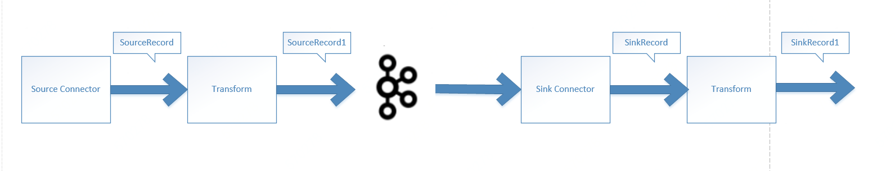

| Connectors           | References                                                   |
| -------------------- | ------------------------------------------------------------ |
| Jdbc                 | [Source](https://github.com/apache/ignite/tree/master/modules/kafka)，[Sink](https://github.com/apache/ignite/tree/master/modules/kafka) |
| Elastic Search       | [Sink1](https://github.com/ksenji/kafka-connect-es), [Sink2](https://github.com/hannesstockner/kafka-connect-elasticsearch), [Sink3](https://github.com/DataReply/kafka-connect-elastic-search-sink) |
| Cassandra            | [Source1](https://github.com/tuplejump/kafka-connect-cassandra), [Source 2](https://github.com/datamountaineer/stream-reactor/tree/master/kafka-connect-cassandra), [Sink1](https://github.com/tuplejump/kafka-connect-cassandra), [Sink2 ](https://github.com/datamountaineer/stream-reactor/tree/master/kafka-connect-cassandra) |
| HBase                | [Sink](https://github.com/mravi/kafka-connect-hbase)         |
| Syslog               | [Source](https://github.com/jcustenborder/kafka-connect-syslog) |
| MQTT (Source)        | [Source](https://github.com/evokly/kafka-connect-mqtt)       |
| Twitter (Source)     | [Source](https://github.com/rollulus/twitter-kafka-connect), [Sink](https://github.com/Eneco/kafka-connect-twitter) |
| S3                   | [Sink1](https://github.com/qubole/streamx), [Sink2](https://github.com/DeviantArt/kafka-connect-s3) |
| confluent connectors | [connectors](https://www.confluent.io/hub)                   |

### connect rest api

  1. [Rest API](https://kafka.apache.org/documentation/#connect_rest)


### connector 框架


使用kafka connect脚本启动一个connector时，实际上启动的是一个Connet这个类。主要包含了Herder和RestServer这两个类。RestServer就是起了一个http 服务器，用来支持api级别管理connector,增加删除等。（或者可以在启动时配置上所有需要加载的connector）


Herder主要是用来管理调度 worker，加载新的connector等。


Worker 是真正执行task的抽象，保存了所有加载了的connector以及对应的task。会执行对应的task。plugins主要是动态加载增加的connetor及相关依赖。

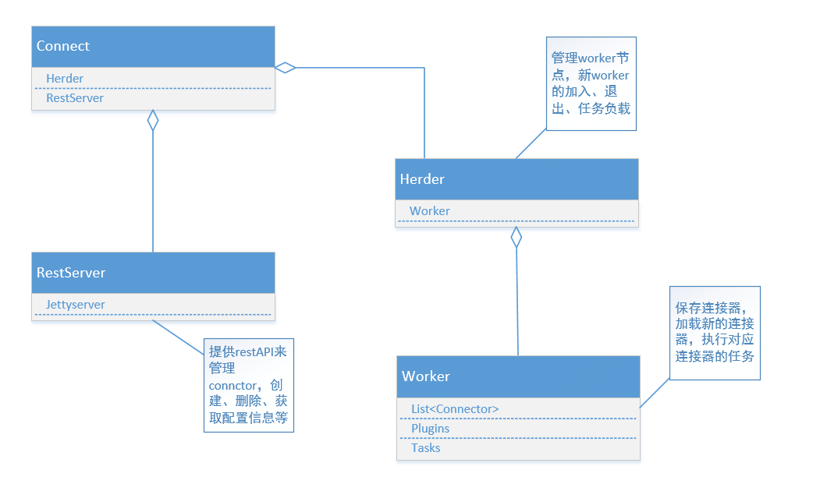

  如果希望自行开发 kafka  connector重点是实现Connector 以及对应的SourceTack或者SinkTask 。

  

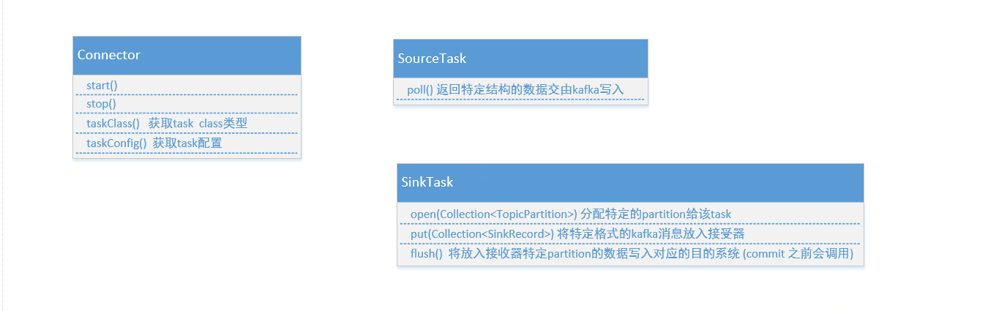


Connector重点关注taskClass()和taskConfig()两个函数， taskClass主要用于获取task的类型，用于运行时的反射调用。taskConfig用于获取task相关的配置

SourceTask 主要是poll()这个函数，worker会重复调用这个函数来获取新的消息以写入kafka中。

SinkTask  open() 主要是将特定的partition分配给当前task(task启动时以及partition重新分配)，这些partition只属于这个task。

​				put() 将分配的那些partition数据写入sinkTask

​				flush() kafka consume 提交offset时会调用该方法，保证这个offset之前的所有数据都成功发出。可以用于task意外停止后的重启，能从最近的offset开始接着消费。

关于put()和flush()   一般情况在put方法里就可以处理完数据，flush方法不用做任何事(jdbc sink connector)。但有些情况可能是将很多消息通过put方法累积起来，然后通过flush方法真正写入目的系统(例如 es  sink connector)

#### JMQ sink connector 

jmq sink connector 实现如下：

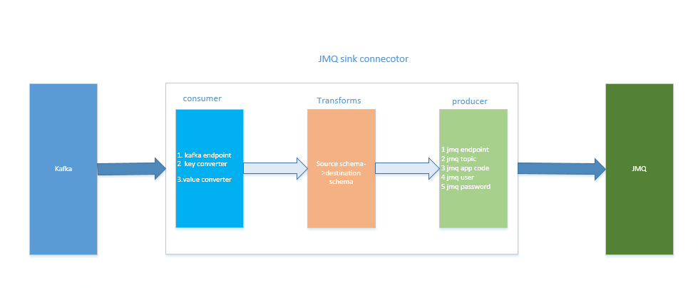

#### JMQ sink connector API

[JMQ sink connector API](https://cf.jd.com/display/CLOUDCMW/JMQ+connector)