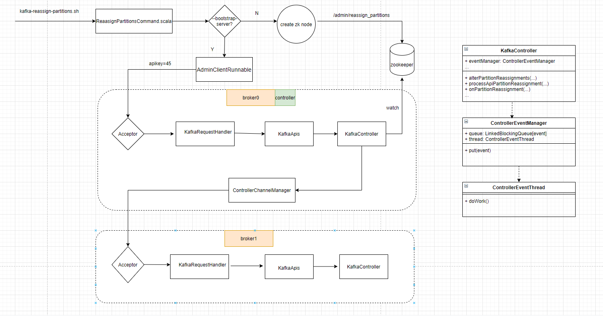

[TOC]


## kafka分区迁移

### 分区迁移背景

当集群中的一个节点down了，kafka并不会自动将副本从down的节点迁移到其它live的节点，如果放任不管，会影响整个集群的均衡负载和整体服务的可用性和可靠性，如果是有计划的下线一些节点，为了保证分区及副本的合理分配，我们也希望能够将下线节点上的分区副本迁移到其它可用节点上。

当集群中新增broker节点时，只有新创建的topic分区才有可能被分配到这个节点上，之前的topic分区不会自动分配到新增的节点，这样新增节点的负载和原先节点的严重不平衡，这就需要一种手段来实现分区重分配，好在kafka提供了客户端脚本可以做到。

### Kafka分区迁移脚本

脚本在kafka客户端bin目录下可找到，名为kafka-reassign-partition.sh, windows执行的在bin/windows目录下，对应名称的bat文件。

kafka分区迁移客户端命令行执行分区重分配需要3步，具体如下：

1. 创建一个含topic清单的json文件如reassign.json，比如这里需要分区迁移的topic为topic-reaasign, 则json文件内容为

   ```json
   {
       "topics":[
           {
               "topic":"topic-reassign"
           }
       ],
       "version":1
   }
   ```

2. 根据上面这个json文件和指定要分配的broker节点列表生产一份proposed的重分配方案，执行命令

   ```shell
   bin/kafka-reassign-partition.sh --bootstrap-server localhost:9092 --generate --topics-tomove-json-file reassign.json --broker-list 0,1,2,3
   ```


   会看到输出两个部分，一个是当前的分区分配方案即Current partition replica assignment, 另一个是proposed的新的分配方案即Proposed partition reassignment configuration, 将proposed的新的方案保存为另一个json文件，如newassign.json

3. 执行新的分配方案命令

   ```shell
   bin/kafka-reassign-partition.sh --bootstrap-server localhost:9092 --execute --reassignment-json-file newassign.json
   ```


   由于该命令其实是个异步操作，所以执行完命令后客户端会再次看到重分配前的分区方案，可以将其保存起来以做回滚备用，并输出分区重分配成功启动的信息。

4. 因为是异步操作，所以若想看看分区进度如何，可以接着run下面的命令客户端就会看到哪些partition已经完成分配，哪些还在进行中

   ```shell
   bin/kafka-reassign-partition.sh --bootstrap-server localhost:9092 --verify --reassignment-json-file newassign.json
   ```

### Kafka分区迁移命令底层实现

首先我们看看分区迁移脚本kafka-reassign-partition.sh怎么写的，内容：exec $(dirname $0)/kafka-run-class.sh kafka.admin.ReassignPartitionsCommand "$@" 

其实就是运行了kafka的ReassignPartitionsCommand类来进行处理，这个类有两种处理入口，取决与命令行传入的参数是--bootstrap-server还是--zookeeper-server，前者采用kafka api请求的流程，后者（以后的版本将会sunset掉）主要采用的zookeepr事件处理机制，如果是后者，这个脚本最终是在zookeeper创建一个/admin/reassign_partitions节点，kafkaController监听这个创建事件并收到事件通知后采取一系列的逻辑处理。本文主要以api请求的方式，其主要处理方法为handleAction，里面根据命令类型进行不同的操作，对上述步骤2，3，4都有相应的处理方法，其中generateAssignment方法用来处理步骤2，executeAssignment方法用来处理步骤3。在generateAssignment方法里调用到了一个核心方法即calculateAssignment方法，这个方法的输出即为proposed的分区方案，感兴趣的可以去看一下怎么算的。executeAssignment里最终会调用到alterPartitionReassignments方法，这个方法调用KafkaAdminClient的同名方法, KafkaAdminClient提供了好多操作方法，其最终都是将request封装成对应的Call对象然后加入到请求队列中，然后由AdminClientRunnable这个线程去消费，并将请求(指定相应的apikey)发给controller节点。

Kafka server在启动的时候会初始化KafkaController以及KafkaRequestHandler，KafkaRequestHandler是一个线程，循环处理发送过来的api请求并将其交给KafkaApis这个类去handle，KafkaApis是处理api request的工具类，里面提供处理所有api请求的方法，如对应上述发送过来的分区迁移请求(apikey=45)，处理方法为handleAlterPartitionReassignmentRequest, 但是这个方法最终还是调用了KafkaController类，即真正开始处理分区迁移请求的类。

Kafka的api请求处理采用的event driven的方式，不同api请求产生不同的event，单线程自旋消费。这里的event比如分区迁移事件，将上述api请求包装成分区迁移事件，然后丢到事件队列中，消费的线程类为ControllerEventThread, 其中doWork方法从事件队列中不停阻塞读取事件，然后还是交由KafkaController进行处理，处理方法入口为process(event), 针对不同的event(也即不同的api请求）响应不同的process方法，对分区迁移这个事件，对应的处理方法为processApiPartitionReassignment, 这个方法就是开始处理分区迁移逻辑的地方。

KafkaController.processApiPartitionReassignment 这个方法主要逻辑包括：

* 验证replicas是否有效，Replicas不能为空，Replicas不能有duplicate，Replicas不能有brokerid <0，新增加的Replicas不能有not alive的broker
* 将参数replica包装成ReplicaAssignment对象, 如原始replica{1，2} 目标replica为{3,4}, 则包装后的对象为ReplicaAssignment{replica:{1,2,3,4}, adding:{3,4}, removing:{1,2}}， 该对象将用于后续方法处理
* 如果有上文提到的zk的reassignment在进行，判断zk所有当前reassign的topic-partition在不在当前api reassign里，如果在就要remove掉以新过来的api里的为准，如果不存在，不影响，继续在zk里进行reassign，所以这里可能要重写zk里的reassignment即更新节点/admin/reassign_partitions的数据
* 检查每一个topic是否是deleted，如果已经deleted，返回对应的error, 如果没有deleted，进一步检查当前的topic-partition是否存在，如果不存在则返回topic或partition不存在的error, 如果存在则执行onPartitionReassignment方法

KafkaController.onPartitionReassignment 方法是整个分区迁移实现的最核心的方法，主要逻辑包括：

* 更新zk当前replicas state信息, 当前副本 = 当前副本 + 目标副本，更新内存当前replicas state信息，zk的state node数据更改会触发watcher event，最终回调到ZooKeeperClientWatcher的process方法对event进行处理，将会再次进入到onPartitionReassignment方法进行剩下的流程。
* 将之前内存replica信息和分配的replica做比较，不在分配内的replica将被stop并执行replica状态机变更
* 注册zk partition state change watch事件（ParitionReaasignmentIsrChangeHandler）到local map里，这里在zk返回notification时会从map里判断是否已经定义了事件（path=/xxx/{partitionId}/state）根据事件path来获取对应的handler如上进行进一步处理。
* 判断当前assignment有没有完成，如果没有adding或removing的replica，或者目标replica已经在ISR列表里，表明assign完成，如果完成进行Flow2，否则Flow
* **Flow1**
          更新partition的leaderEpoch+1，并广播给分区所有的replicas所在的broker更新leaderIsr信息；将新增加的replica的状态改为NewReplica，并广播replica信息给replica的broker，Flow1结束后新增加的副本要么变成leader要么变成follower，follower会定时去fetch leader的消息，如果完全同步了就会加入ISR并更新zk里的ISR，当所有新增的replica都成为ISR后，由于ISR变化会触发zk事件通知watcher，即ZooKeeperClientWatcher会进行收到通知后的处理，如果TR是ISR的子集就会进入FLow2
* **Flow2**
  1. 更新replica状态为OnlineReplica,并广播给replica的broker
  2. 更新controller缓存信息，将当前rs更新为target rs
  3. 给target replica重新分配leader，比如当前的leader不在target RS里的话就得重新选一个
  4. 将待remove的replica状态更新为Offline -> NonExistentReplica, 并通知replica的broker删除该副
  5. 更新ZK的RS为target RS
  6. Remove掉ISR reassign listener， 同时可能会更新zk的/admin/reassign_partitions 数据，将当前分配完的partition删掉
  7. 给replica选完leader后，replica和isr信息都变了，发送metadata request给所有broker
  8. 将topic不能删除的标记去掉

源码里对这个核心的方法注释很多，有兴趣可以去阅读一下，其中涉及到的副本状态机变化和副本管理相关的将另行介绍


### Kafka 分区迁移API 流程图

